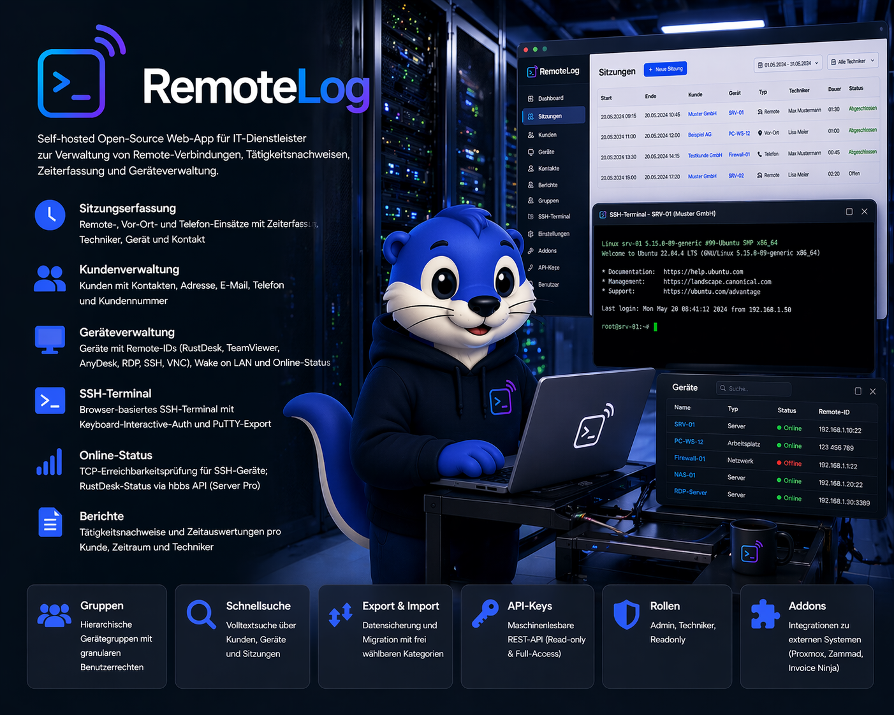
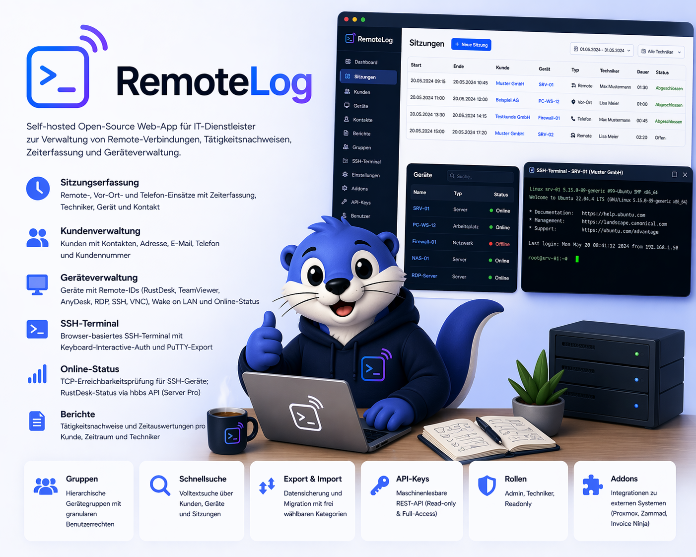

# RemoteLog

Self-hosted Open-Source Web-App (AGPL-3.0) für IT-Dienstleister zur Verwaltung von Remote-Verbindungen, Tätigkeitsnachweisen, Zeiterfassung und Geräteverwaltung.

<p align="center">
  
</p>

---

## Features

- **Sitzungserfassung** — Remote-, Vor-Ort- und Telefon-Einsätze mit Zeiterfassung, Techniker, Gerät und Kontakt
- **Kundenverwaltung** — Kunden mit Kontakten, Adresse, E-Mail, Telefon und Kundennummer
- **Geräteverwaltung** — Geräte mit Remote-IDs (RustDesk, TeamViewer, AnyDesk, RDP, SSH, VNC), Wake on LAN und Online-Status
- **SSH-Terminal** — Browser-basiertes SSH-Terminal mit Keyboard-Interactive-Auth und PuTTY-Export
- **Online-Status** — TCP-Erreichbarkeitsprüfung für SSH-Geräte; RustDesk-Status via hbbs API (Server Pro)
- **Berichte** — Tätigkeitsnachweise und Zeitauswertungen pro Kunde, Zeitraum und Techniker
- **Gruppen** — Hierarchische Gerätegruppen mit granularen Benutzerrechten
- **Schnellsuche** — Volltextsuche über Kunden, Geräte und Sitzungen
- **Export & Import** — Datensicherung und Migration mit frei wählbaren Kategorien
- **API-Keys** — Maschinenlesbare REST-API (Read-only & Full-Access)
- **Rollen** — Admin, Techniker, Readonly
- **Addons** — Integrationen zu externen Systemen (Proxmox, Zammad, Invoice Ninja)

<p align="center">
  
</p>

---

## Addons

| Addon | Funktion |
|-------|----------|
| [Proxmox](../../wiki/Addon-Proxmox) | VMs und Container automatisch importieren, SSH/Konsole/RDP direkt aus RemoteLog |
| [Zammad](../../wiki/Addon-Zammad) | Kunden und Kontakte bidirektional synchronisieren, Tickets anzeigen |
| [Invoice Ninja](../../wiki/Addon-Invoice-Ninja) | Kunden synchronisieren, Rechnungen anzeigen, Sitzungen als Tasks übertragen |

---

## Schnellstart

```bash
git clone https://github.com/Beseco/remotelog.git
cd remotelog
cp .env.example .env
# .env befüllen (NEXTAUTH_SECRET, NEXTAUTH_URL, REMOTELOG_API_KEY_SECRET)
docker compose up -d
```

Dann im Browser `/setup` aufrufen und den Einrichtungsassistenten durchlaufen.

Detaillierte Anleitungen im **[Wiki](../../wiki)**:
- [Docker Compose](../../wiki/Installation-Docker-Compose)
- [Coolify](../../wiki/Installation-Coolify)
- [Lokale Entwicklung](../../wiki/Installation-Lokale-Entwicklung)

---

## Tech Stack

- **Frontend:** Next.js 16 (App Router), React 19, TypeScript, Tailwind CSS 4, shadcn/ui
- **Backend:** Next.js API Routes (Node.js)
- **ORM:** Prisma 7 + PostgreSQL
- **Auth:** NextAuth.js v5 (Credentials + JWT)
- **Lizenz:** AGPL-3.0

---

## Lizenz

[AGPL-3.0](LICENSE)
